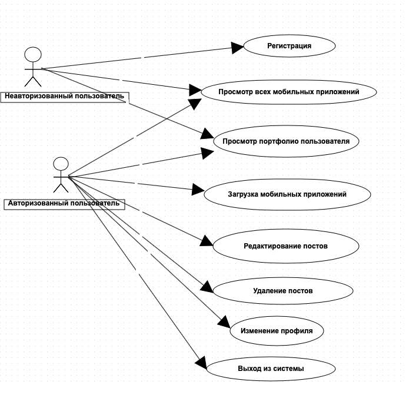
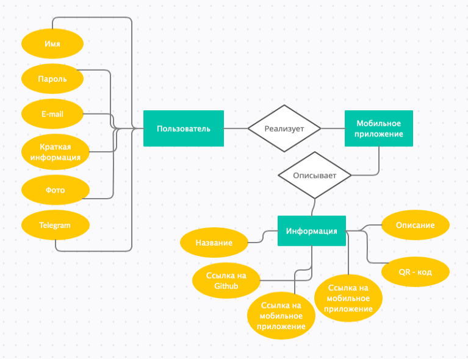
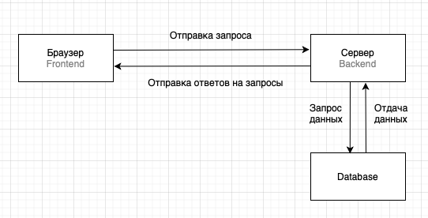

# web_lab03

1. Название проекта: PortMobiApps
2. Краткое описание проблемной области и актуальности
    1. Какая проблема:  Отсутствие визуального представления мобильных приложений и скачивания из портфолио
    2. Источник проблемы: Личный опыт
    3. Какой подход выбран для решения: Создание сайта, содержащее мобильные приложения разработчиков с возможностью скачивания на телефон
3. Описание ролей пользователя
    1. Use-Case диаграмма (основные кейсы)

    2. Назначение ролей пользователя
        - Гость
        - Пользователь
4. Сущности предметной области
    1. ER-диаграмма сущностей

5. Прототип интерфейса (sketch) со всеми страницами. (ссылка на  Figma). Краткое описание основных функциональных действий.
[Figma](https://www.figma.com/file/c4sYlfEuuOEkrOEPdMiGa1/PortMobiApps-Makeeva-ED-IU7-68%D0%91-%D0%92?node-id=0%3A1)
6. Архитектура приложения
    1. Выбор архитектуры (MPA-SPA): MPA
    2. Диаграмма взаимодействия Backend-Frontend

    3. Описание протокола взаимодействия Backend-Frontend / Rest API - при наличии 
        - api/v1/registr POST - запрос на регистрацию
        - api/v1/login POST - вход
        - api/v1/user/:id PUT - изменение данных пользователя
        - api/v1/user/:id GET - получение информации о пользователе
        - api/v1/apps GET - получение всех приложений
        - api/v1/apps?userId GET - получение всех опубликованных приложений пользователя
        - api/v1/apps POST - добавление приложения на сайт
        - api/v1/apps/:id PUT - обновление информации о приложении на сайте
        - api/v1/apps/:id DELETE - удаление приложения
    4. Структура модулей/классов для Backend и Frontend
Спецификация ответа api/v1/apps:
```
[
    {
        "id": string,
        "author": string,
        "name": string,
        "info": string,
        "github": string,
        "link": string,
        "qrCode": string,
        "tags": string
    }
]
```
Спецификация ответа api/v1/user:
```
{
    "id": string,
    "name": string,
    "about": string,
    "photo: string,
    "email": string,
    "telegram": string,
}
```

7. Технические детали реализации
    1. Выбор Backend- и Frontend-стеков - Backend: Spring, Kotlin; Frontend: HTML, CSS
    2. Команда: состав, четкое распределение ролей:
        - Макеева Елена Дмитриевна - Дизайнер, Бизнес аналитик, Системный Аналитик, Backend Разработчик, Frontend Разработчик, Тестировщик и мастер на все руки
9. Структура и подход к CI/CD для проекта (дополнительное задание). Пока в работу не берется.

Issues по ТЗ остались на гите кафедры :)
